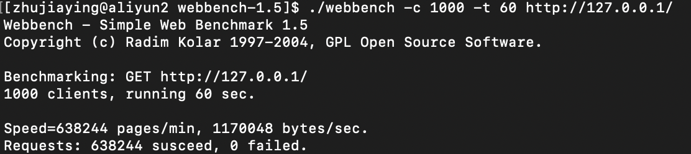
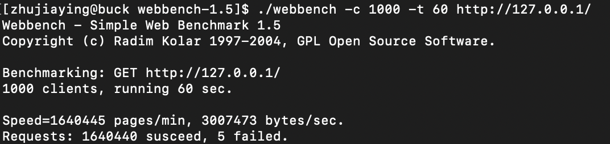

简易个人博客上线工具

所需工具：云服务器一台，Notion软件

### 项目简介

一款简易的个人博客上线工具。后端Web服务器采用C++编写，带有异步日志，支持长短连接。前端页面由Notion笔记自动生成。

### 使用方法

1. 将resourse文件夹中的资源替换成自己的主页默认页面，或Notion自动生成的页面包。

2. 将main函数中的 `httpserver.Init(80, "藏宝阁 2d05c1d04c964b92852be60208ad61d3.html");` 的第二个参数改成主页的html文件名

3. ```shell
   mkdir build
   cd build
   cmake ../
   make
   mkdir log #创建日志文件夹
   ./BlogPoster #运行
   ```

4. 在浏览器中输入url，例如云服务器的ip是`xx.xx.xx.xx`，则输入`http://xx.xx.xx.xx`，即可访问


### 介绍

#### 网络IO模型：

半同步/半反应堆模型，epoll（LT+ET）+线程池

- 主线程中对所有套接字进行epoll_wait，分为两种情况：
  1. 当有新的连接，则accept并新的套接字其注册到epoll（ET+非阻塞）
  2. 当某个套接字上有新的事件（例如数据到来或缓冲区可写），则将该「套接字+事件」封装成对象放入任务队列
- 另外线程池中有n个工作线程，沉睡在任务队列上，当有任务时就会被唤醒，取出任务并执行。

#### 定时器的实现：

这里采用的是「链表」结构。假设对于所有连接一视同仁，即每个连接的超时时间都是相同的，因此，每次该连接有新事件发生时，只需将对应的定时器放到链表头部。这样，链表从头到尾就是「按剩余超时时间降序排列」，因此剔除超时连接时，只需从尾部开始，到达第一个未超时的定时器即可结束。**从而实现更新和删除都是O(1)的时间复杂度。**

#### 同步日志和异步日志的实现：

同步日志：在每一个写日志处写入文件。

异步日志：单独开一个线程（或进程），要求写日志的线程会将内容加入队列，日志线程从队列中依次读取内容写入文件。

#### 几处加锁：

对于某个连接套接字，EPOLLONESHOT保证同一时间只有一个线程在对其读写，但是该套接字可能会因超时而被主线程关闭，因此存在线程安全问题的地方是：**连接关闭时、定时器更新时**；此外，定时器链表中采用智能指针，存在智能指针的线程安全问题，因此**写智能指针时**需加锁。

#### 前端页面：

Notion笔记软件，可以自动导出为html文件，将文件放入resourses文件夹，并修改HttpParser中的默认url，即可实现将笔记变为个人博客上线。


### 压测记录

由于从另一台机器访问服务器会存在带宽受限的问题，因此在同一台机器上运行服务器和压测软件，尽管这可能会使服务器的性能降低。这里线程数设置为4。

#### 压测环境1：云服务器

操作系统：Centos 8

CPU：Intel(R) Xeon(R) CPU E5-2682 v4

内存：2G



QPS=10000+


#### 压测环境2：个人电脑

操作系统：Centos 8

CPU：AMD FX(tm)-6300

内存：8G



QPS=27340


### 更新日志

- 2021.06.22 简陋版WebServer，epoll+线程池（线程死循环访问任务队列）
- 2021.06.23 增加：http可读取同一用户连续多个请求；增加：定时器；增加：短连接
- 2021.06.25 增加：Buffer类、HttpParser类、HttpResponse类，优化结构；修复bug：超时关闭的线程安全问题
- 2021.06.25 增加：同步、异步日志
- 2021.06.28 增加：根据用户的请求头，确定长短连接；增加：数据库连接池，供将来使用；增加：html页面；增加：文件传输零拷贝
- 2021.06.28 修复bug：日志中重复关闭文件的bug
- 2021.06.29 修复bug：TimerManager中智能指针的线程安全问题
- 2021.06.30 将HttpServer、Log改为单例模式


### 待完成

- 完善对于http协议的支持
- 后端改为one thread one loop模型，减少锁的竞争，提高并发量
